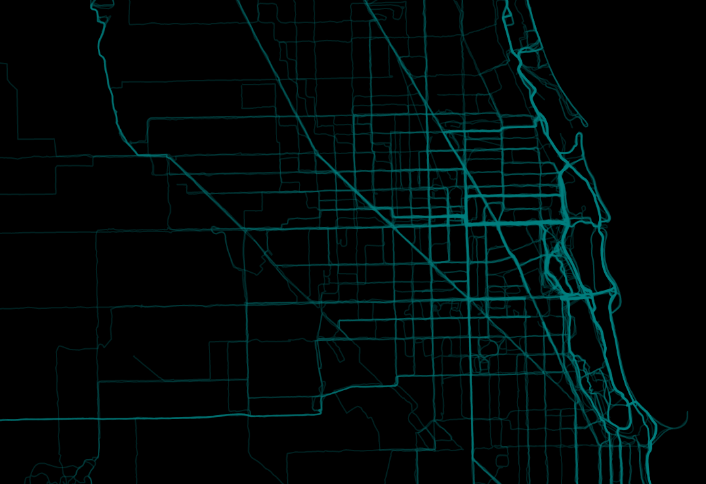

# strava_heatmap
Let users connect to the Strava API in order to populate their own personal, customizable activity heatmap

Strava users can see it in action <a href="https://cultureplot.com/strava-heatmap" target="_blank">here</a>.
Non-Strava users can see a video demonstration <a href="https://www.reddit.com/r/Strava/comments/m5862y/my_own_take_on_the_strava_heatmap/" target="_blank">here</a>. 

- PHP
  - oauth.php: allows for initial token exchange with Strava API
  - reoauth.php: used to refresh an expired token 
  - geocode.php: used to reverse_geocode the latitude and longitude coordinates received from Strava for the purpose of providing user with a list of neighborhoods they commonly start activities in

- JavaScript
  - BigImage.js: powers the screenshot function (original credit to <a href="https://github.com/pasichnykvasyl/Leaflet.BigImage">pasichnykvasyl</a>)
  - strava_api.js: checks for presence of authorization or refresh token; calls oauth.php and reoauth.php; calls activities endpoint
  - script.js: contains drawHeatmap() function, which handles all Leaflet and most front end code
  - ui.js: event listeners for user-activated functions; adds JQuery sliders; contains reverse_geocode function

# strava_heatmap_no_API
A near-copy of /heatmap, but runs on a local data source, rather than the Strava API itself, for development and testing purposes.

Note: current only up to August 2021, as the newer 'demo' and 'manual file upload' modes added to /heatmap provide more or less obsolete this no-API version.  

- PHP
  - geocode.php: used to reverse_geocode the latitude and longitude coordinates received from Strava for the purpose of providing user with a list of neighborhoods they commonly start activities in

- JavaScript
  - BigImage.js: powers the screenshot function (original credit to <a href="https://github.com/pasichnykvasyl/Leaflet.BigImage">pasichnykvasyl</a>)
  - script.js: reads data; handles all Leaflet and most front end code
  - ui.js: event listeners for user-activated functions; adds JQuery sliders; contains reverse_geocode function

- Data
  - activities_sample.csv: sample data of activities (PII removed)
  - To test with your own activities data, simply <a href="https://www.strava.com/athlete/delete_your_account" target="_blank">download from Strava</a> or <a href="https://towardsdatascience.com/using-the-strava-api-and-pandas-to-explore-your-activity-data-d94901d9bfde" target="_blank">use their API</a>
